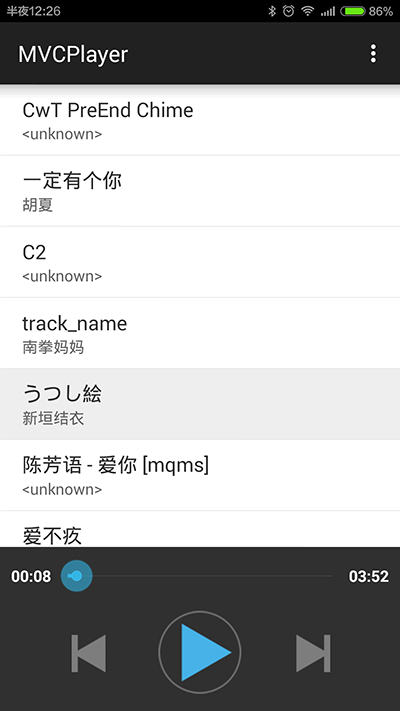

#MVCPlayer

我尝试在android上使用MVC模式来开发一个音乐播放器。

##什么是MVC
[来自维基百科](http://zh.wikipedia.org/zh/MVC)

1. 控制器 Controller - 负责转发请求，对请求进行处理。
2. 视图 View - 界面设计人员进行图形界面设计。
3. 模型 Model - 程序员编写程序应有的功能（实现算法等等）、数据库专家进行数据管理和数据库设计(可以实现具体的功能)。

那么在android上，Activity就是Controller了。

##划分职责
1. activity负责处理view的事件和获取模型数据并刷新视图。
2. view只负责显示
3. model就是数据部分，不能更新view，数据改变必须通过activity更新view。

##设计我们的播放器

###Models

1. Music - 代表一首歌曲，有歌名、路径、歌手等信息
2. MusicPlayer - 播放器，我们的逻辑处理部分。

为什么播放音乐不在Activity里面做呢？

播放音乐是Model的一部分，而不是Activity的一部分。

我认为模型代表what it is?

所以播放器是一个model，我设计一个播放器类来封装播放音乐的逻辑。

*MusicPlayer.java*

```
public class MusicPlayer {
    public interface PlayerListener {
        void onPlay();
        void onPause();
        void onResume();
        void onPlayNext();
        void onPlayPrev();
        void onProgressUpdate(int progress);
    }

    private static MusicPlayer sMusicPlayer;
    private List<Music> mPlayList;          // 播放列表
    private boolean mPlaying;               // 是否正在播放
    private int mCurrentIndex;              // 目前播放的位置
    private int mCurrentProgress;           // 播放进度
    private MediaPlayer mMediaPlayer;       // 播放器
    private PlayerListener mListener;       // 监听器
    private Timer mTimer;                   // 计时器
    private int mTotalTime;                 // 播放时间
    public static MusicPlayer getInstance(){...}
    public void play(final int index) {...}
    public void pause() {...}
    public void resume() {...}
    public void playNext() {...}
    public void playPrev() {...}
```

为了当播放器内部状态改变的时候通知Activity，我定义了一个PlayerListener

## Views
视图就是xml文件，没什么好说的了。

##Activity

Activity里面包含了视图对象和播放器对象。

首先通过ContentResolver获取手机里面的歌曲，
然后放到播放器里面，同时放到播放列表的adapter里面。

```
mMusicPlayer = MusicPlayer.getInstance();
mMusicPlayer.setPlayList(getPlayList());
mMusicPlayer.setListener(getPlayerListener());

mMusicListAdapter = new MusicListAdapter(this, getPlayList());
mMusicListView.setAdapter(mMusicListAdapter);
```

当点击列表时，告诉播放器播放音乐。

```
mMusicListView.setOnItemClickListener(new AdapterView.OnItemClickListener() {
    @Override
    public void onItemClick(AdapterView<?> parent, View view, int position, long id) {
        mMusicPlayer.play(position);
    }
});
```

这时候播放器的状态改变，`onPlay`方法被调用，通知Activity更新视图：

```
public MusicPlayer.PlayerListener getPlayerListener() {
    if (mPlayerListener == null) {
        mPlayerListener = new MusicPlayer.PlayerListener() {
            @Override
            public void onPlay() {
                updateUI();
            }

            @Override
            public void onPause() {
                updateUI();
            }

            @Override
            public void onResume() {
                updateUI();
            }

            @Override
            public void onPlayNext() {
                updateUI();
            }

            @Override
            public void onPlayPrev() {
                updateUI();
            }

            @Override
            public void onProgressUpdate(int progress) {
                updateUI();
            }
        };
    }
    return mPlayerListener;
}
```

整个过程是：View发出action，controller改变model，model通知controller状态改变，controller更新view。

#小结

MVC模式使我们更好地设计软件，各部分的职责分工明确。Model和View相对独立，易于更改。例如我不想在Activity里面播放音乐，完全可以把MusicPlayer放到Service上去播放，而且播放代码一句也不用改。

